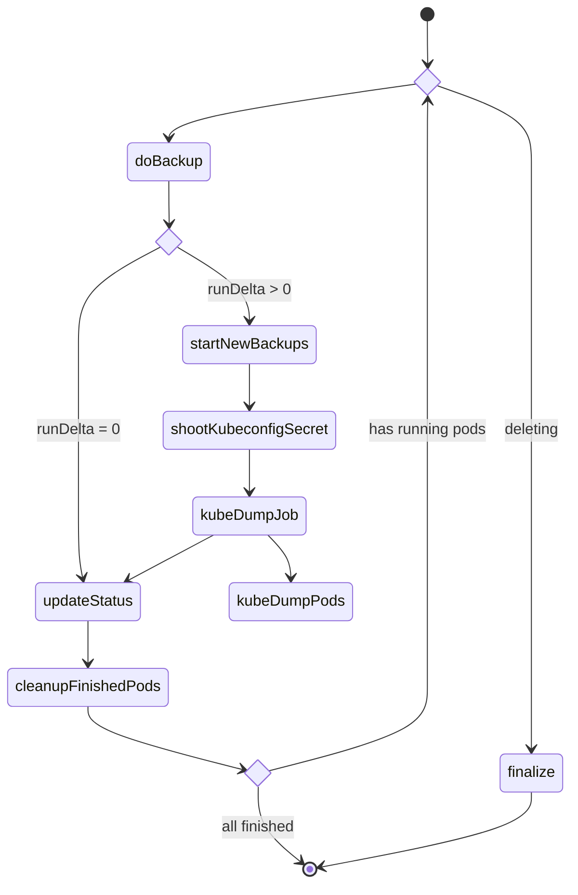

# CreateKubeSnapshot

## Reconciling State Diagram

```mermaid
stateDiagram-v2
    state reconcile <<choice>>
    [*] --> reconcile

    reconcile --> doBackup
    reconcile --> finalize: deleting

    state counterCheck <<choice>>

    doBackup --> counterCheck

    counterCheck --> startNewBackups: runDelta > 0
    counterCheck --> updateStatus: runDelta = 0

    startNewBackups --> shootKubeconfigSecret
    shootKubeconfigSecret --> kubeDumpJob

    kubeDumpJob --> kubeDumpPods
    kubeDumpJob --> updateStatus

    updateStatus --> cleanupFinishedPods

    state isRunning <<choice>>
    cleanupFinishedPods --> isRunning

    isRunning --> reconcile: has running pods
    isRunning --> [*]: all finished

    finalize --> [*]
```
